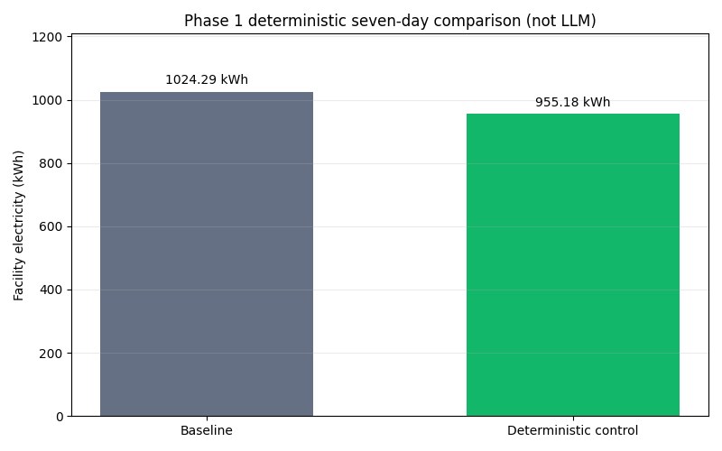
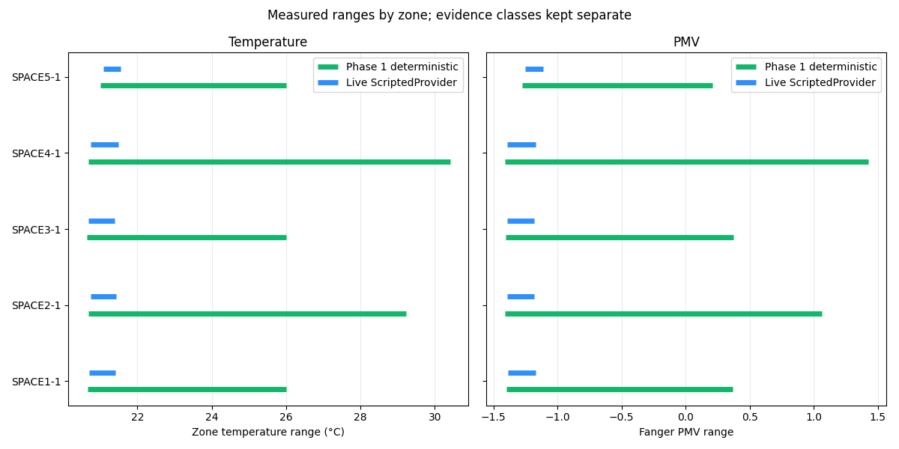
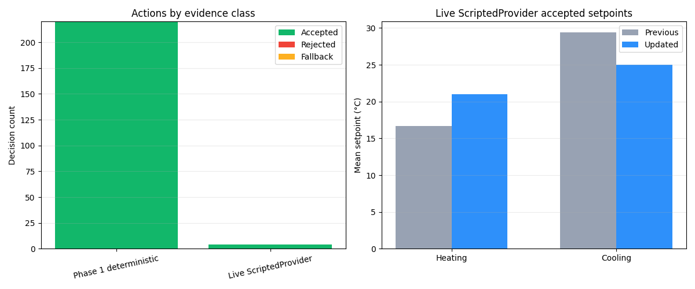

# Current verified results

This page separates the three evidence classes in the repository. The
seven-day Phase 1 result and four-hour ScriptedProvider smoke are deterministic
and are not described as real-LLM-generated savings.

## 24-hour real Ollama-supervised hybrid comparison

The real-provider comparison used `llama3.2:3b` with the same EnergyPlus
model, Chicago weather period, 15-minute timestep, and initial snapshot in
both cases.

- Baseline electricity: **180.556 kWh**
- Ollama hybrid electricity: **168.703 kWh**
- Reduction: **11.853 kWh (6.565%)**
- Baseline/controlled peak demand: **17.258/15.566 kW**
- Baseline/controlled zone-temperature range:
  **20.63-23.90/20.00-26.00 C**
- Baseline/controlled PMV range: **-1.41 to 0.21/-1.49 to 0.67**
- Occupied PMV compliance: **96.82%/95.45%**
- Occupied comfort violations: **7/10**
- Accepted/rejected/corrected/fallback actions: **24/0/0/0**
- Successful zone-actuator writes: **460**
- Median/maximum LLM latency: **19.457/28.487 seconds**
- Baseline and controlled EnergyPlus exit/severe/fatal: **0/0/0**

The Ollama-supervised run reduced energy and peak demand, while occupied PMV
compliance decreased slightly from 96.82% to 95.45%, with comfort violations
increasing from 7 to 10.

Sources:
[JSON](../runs/final/ollama_24h_comparison.json),
[CSV](../runs/final/ollama_24h_comparison.csv), and
[comparison report](ollama_24h_comparison.md).

## Phase 1 deterministic seven-day comparison

This result was produced by the fixed Phase 1 diagnostic controller, not by
Ollama.

- Baseline electricity: **1,024.291 kWh**
- Controlled electricity: **955.179 kWh**
- Deterministic reduction: **69.112 kWh (6.747%)**
- Duration: **168.0 hours**, **672 timesteps**
- Baseline/controlled zone-temperature range:
  **20.63-30.40/20.63-30.41 C**
- Baseline/controlled PMV range: **-1.41 to 1.42/-1.41 to 1.42**
- Occupied PMV comfort violations: **24/28**
- Deterministic actions accepted/rejected: **220/0**
- Successful zone-actuator writes: **1,100**

## Live ScriptedProvider smoke

This is deterministic integration evidence, not a real LLM comparison.

- Facility electricity during smoke: **1.900 kWh**
- Energy savings: **not calculated** because no matched four-hour baseline
  was run
- Duration: **4.0 hours**, **16 timesteps**
- Zone-temperature range: **20.67-21.55 C**
- PMV range: **-1.39 to -1.11**
- Occupied PMV comfort violations: **0**
- Actions accepted/rejected/corrected/fallback: **4/0/0/0**
- MCP tools called: `read_sensor_data`, `get_grid_carbon_intensity`,
  `log_reasoning`, `set_control_action`
- MCP tool calls: **16**
- Successful zone-actuator writes: **60**

