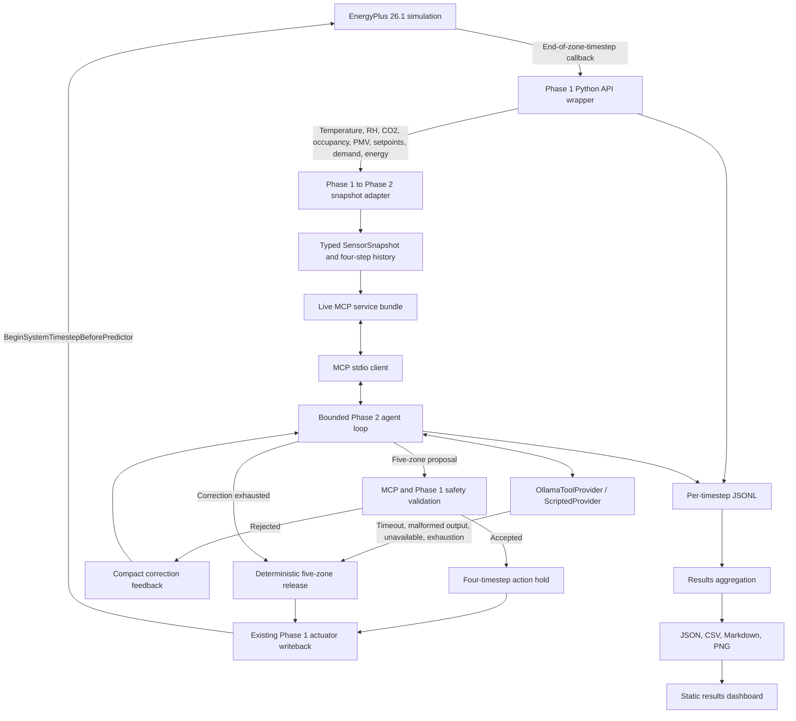
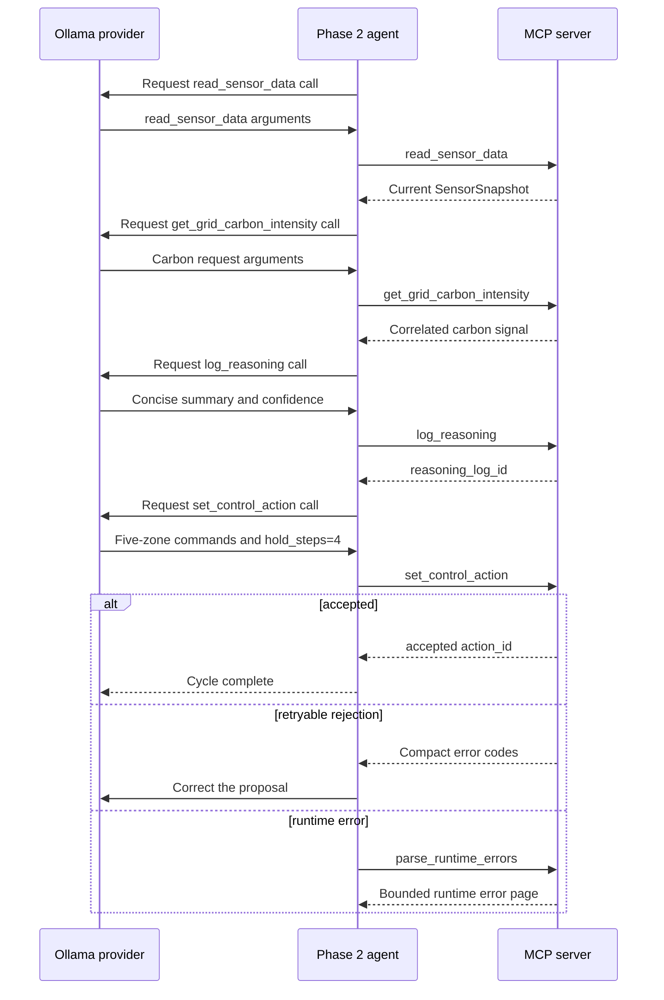

# System architecture

Eco-Loop is a supervisory thermostat-control system built around an existing
EnergyPlus 26.1 Python API integration. It keeps simulation ownership,
low-level handle management, action validation, and evidence capture outside
the language model.

## Architecture overview

## EnergyPlus Python API integration

`src/energyplus_wrapper.py` owns the EnergyPlus state, callbacks, requested
variables, handle resolution, run lifecycle, and error parsing. It excludes
warmup and sizing periods from control and logging.

At the end of each completed 15-minute zone timestep, the wrapper reads:

- zone mean air temperature, relative humidity, CO2, occupancy, and Fanger PMV;
- reported zone heating and cooling setpoints;
- outdoor dry-bulb temperature;
- facility electricity demand and energy.

The wrapper previously proved one heating and one cooling
`Zone Temperature Control` actuator for each of `SPACE1-1` through
`SPACE5-1`. No additional actuator types were introduced for Phase 2.
Validated commands are applied at
`BeginSystemTimestepBeforePredictor`, then the reported setpoints are read back
as evidence.

## Sensor and actuator flow

`map_phase1_snapshot` in `src/live_energyplus_integration.py` translates the
live Phase 1 structure into the Phase 2 `SensorSnapshot` contract. The adapter
preserves simulated time, sequence, per-zone sensor values, reported
setpoints, facility demand, and accumulated facility energy. A current
snapshot plus a bounded four-timestep history is injected into the live MCP
services for each decision cycle.

The controller is called every timestep but starts an agent cycle only when
`sequence % 4 == 0`. That gives one decision per simulated hour. After an
action is accepted, the controller returns the same validated `ControlAction`
for four successive 15-minute callbacks. The existing wrapper performs the
actual actuator set/reset and records the result.

## MCP server and client

`src/mcp_server.py` exposes five strictly typed tools over stdio, and
`src/mcp_client.py` discovers and invokes them through a real MCP session:

| Tool | Responsibility |
| --- | --- |
| `read_sensor_data` | Return the current snapshot and bounded history |
| `get_grid_carbon_intensity` | Return a snapshot-correlated current/forecast carbon signal |
| `log_reasoning` | Store a concise auditable summary, tags, trade-off, and confidence |
| `set_control_action` | Validate and submit one idempotent five-zone action |
| `parse_runtime_errors` | Retrieve bounded cycle-scoped runtime errors for correction |

The MCP contracts add request, cycle, snapshot, reasoning-log, and idempotency
identifiers. The client verifies the advertised schemas and does not replay a
side-effecting tool call after ambiguous transport failure.

## Ollama provider

`src/ollama_provider.py` loads `PHASE2_LLM_PROVIDER`,
`PHASE2_LLM_MODEL`, and optional `OLLAMA_BASE_URL` through the Phase 2
configuration. Startup validation requires `ollama`, a reachable local
endpoint, and an installed configured model before a live simulation starts.

The provider gives the model only the next required tool, its compact JSON
schema, the bounded current observation, and compact feedback from the prior
tool result. It normalizes supported Ollama tool-call shapes into the same
`ScriptedToolCall` contract used by the deterministic provider. Provider
diagnostics record response type, requested tool, validation code, correction
attempt, fallback use, and latency without exposing hidden chain-of-thought.

## Agent tool-call sequence

The normal sequence is fixed:

The agent, not the model, supplies correlation and idempotency fields. A model
cannot skip directly to actuator writeback.

## Validation, rejection, and fallback

`src/phase2_validation.py` checks action structure and live state. All five
configured zones must appear exactly once. Values must be finite and within
configured heating/cooling limits, meet the deadband, respect occupied comfort
bounds, target the current snapshot, reference a correlated reasoning log, and
request no more than four hold steps. Pending severe or fatal runtime errors
block action acceptance. Validation returns explicit error codes and never
silently clamps unsafe values.

The agent can feed one bounded correction back to the provider when a rejection
is retryable. Stale data triggers a refreshed sensor/carbon path. Runtime
failures can invoke `parse_runtime_errors`. If the provider times out, returns
malformed output, exhausts its attempts, or raises any other exception, the
live controller creates a deterministic release action. That action is
validated again before the existing Phase 1 actuator reset path is used.

## Latency management

The live design decouples EnergyPlus' 15-minute simulation timestep from model
inference:

- only one model decision is requested per simulated hour;
- each accepted action is held for four timesteps;
- provider calls have a 30-second ceiling in the live loop;
- the local-model prompt contains only the next tool and bounded observations;
- temperature is zero and the response token/context budgets are bounded;
- any timeout immediately selects deterministic release rather than blocking
  actuator safety.

In the verified 24-hour run, median model latency was 19.457 seconds and the
maximum was 28.487 seconds.

## Evidence and logging pipeline

Every live controller timestep appends JSONL containing simulated timestamp,
snapshot ID, zone temperatures, PMV, occupancy, facility demand and energy,
selected setpoints, MCP tools called, action status, fallback use, and actuator
write result. Provider diagnostics add response classification, tool request,
validation/correction status, and latency. EnergyPlus summaries add exit,
severe, and fatal counts.

The comparison and aggregation scripts reduce those records into tracked JSON
and CSV outputs and render PNG charts. The offline dashboard reads no external
services; it presents the already verified values and links to the evidence:

- `runs/final/ollama_24h_comparison.json`
- `runs/final/ollama_24h_comparison.csv`
- `runs/final/ollama_24h_energy_peak.png`
- `runs/final/ollama_24h_comfort.png`
- `runs/final/ollama_24h_actions_latency.png`
- `docs/dashboard/index.html`

The seven-day 6.747% result remains labeled as a deterministic Phase 1 result,
separate from the 24-hour real Ollama-supervised result.
