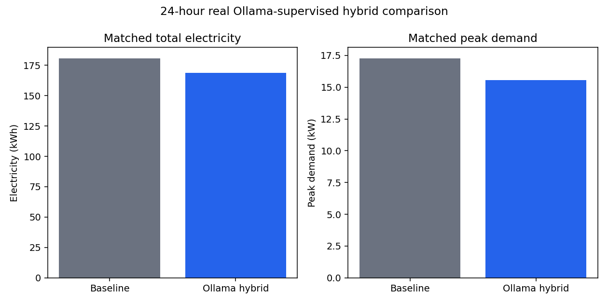
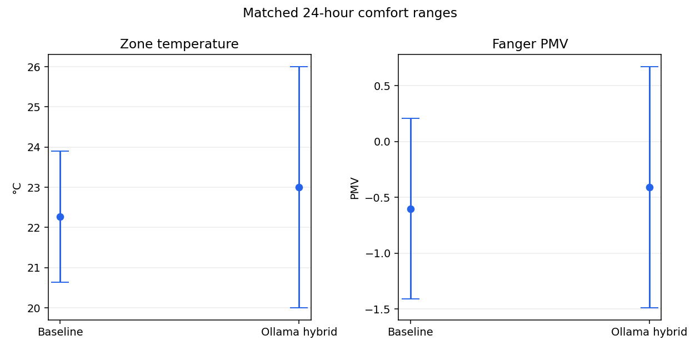
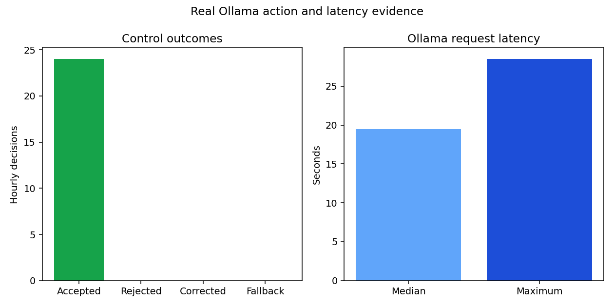

# 24-hour real Ollama-supervised hybrid comparison

This is a matched real-provider comparison using the same EnergyPlus model,
weather start, 15-minute timestep, and initial snapshot for both cases.

## Electricity and demand

- Baseline total electricity: **180.556 kWh**
- Controlled total electricity: **168.703 kWh**
- Controlled minus baseline: **-11.853 kWh**
- Absolute difference: **11.853 kWh**
- Difference from baseline: **-6.565%** (negative means lower controlled use)
- Baseline/controlled peak demand: **17.258/15.566 kW**

## Comfort

- Baseline temperature range: **20.63 to 23.90 °C**
- Controlled temperature range: **20.00 to 26.00 °C**
- Baseline PMV range: **-1.41 to 0.21**
- Controlled PMV range: **-1.49 to 0.67**
- Occupied PMV compliance: baseline **96.82%**, controlled **95.45%**
- Occupied comfort violations: baseline **7**, controlled **10**

## Ollama supervision and safety

- Hourly decisions: **24**
- Real actions accepted: **24**
- Actions rejected: **0**
- Corrected action proposals: **0**
- Deterministic fallbacks: **0**
- Successful zone actuator writes: **460**
- Median/maximum LLM latency: **19.457/28.487 seconds**

## EnergyPlus status

- Baseline exit/severe/fatal: **0/0/0**
- Controlled exit/severe/fatal: **0/0/0**

## Separate deterministic evidence

The existing **seven-day deterministic Phase 1 reduction is 6.747%**. It is
kept separate and is not described as real-LLM-generated savings.
